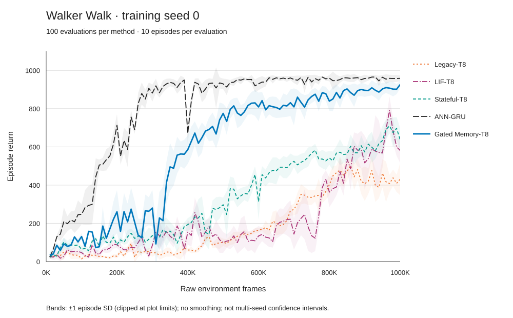

# SpikeDreamer: Gated Dendritic Memory

在 Spiking-WM 的固定 T8 骨架上，让树突状态跨环境转移保留，并根据当前输入学习何时保留、何时写入。当前主方法为 `stateful_gatedmem32`。

研究状态：**已完成 Walker Walk、训练 seed 0 的五组 1M 帧实验；尚未完成多种子、多任务或机制消融验证。** 本仓库是可继续开发的研究原型，不是已发表论文的官方实现。结果更新于 2026-09-14。

## 动机与问题

世界模型需要根据有限历史推断状态，再在潜空间中滚动预测供策略学习。我们关心：脉冲神经元内部的状态能否成为这种历史表示的一部分，以及模型应该如何更新这些状态。

[Spiking-WM](https://github.com/Brain-Cog-Lab/Spiking-WM) 已经提出多房室神经元（MCN）脉冲世界模型。其发布版仍通过上一环境转移的脉冲和随机潜变量保持递归信息，不能称为“没有时间记忆”。但发布实现每次 RSSM 转移会重置模块内部膜状态；胞体放电也会清除树突状态。跨转移的神经元状态与单次转移内的 T8 仿真，是两个不同问题。

我们先把状态显式纳入轨迹，得到 Stateful-T8；它在本地 Walker 实验中高于 Legacy-T8，但与完整 ANN-GRU 仍有明显差距。当前版本进一步检验一个假设：**让树突记忆不随胞体放电清空，并用输入依赖的保留门控制遗忘，能否改善脉冲世界模型的控制表现？** 随机回放片段还配有真实历史预热，以减少片段起点与在线状态之间的不一致。当前结果支持继续研究这个组合，尚未隔离每一项的贡献。

## 解决方案

当前实现保留原 SNN 编码器、解码器、先验/后验读出、Actor、Value，以及固定 T8 的内部计算。修改集中在 RSSM 的树突记忆和训练片段的状态初始化：

- **轨迹拥有状态。** 输入 LIF、MCN 胞体/两路树突及先验 LIF 的边界状态沿真实和想象转移携带；不同轨迹和想象分支不共享隐藏缓存。
- **输入依赖的树突保留。** 当前输入脉冲与上一环境步同内部索引的脉冲拼接，经 `Linear(1024, 1024)` 生成基树突、顶树突各 512 维保留门。
- **保留与写入互补。** 对门 logit `g`，每个内部步使用 `write = -expm1(logsigmoid(g) / T)`，随后 `m = m + write * (candidate - m)`。胞体积分、原顶树突到胞体的门控、阈值和代理梯度不变；放电只复位胞体，真实 episode 边界重置全部状态。
- **32 步真实历史预热 + 64 步完整学习。** 预热来自同一 episode 的真实前缀，无梯度；不足 32 步的位置由 `warmup_valid` 排除。前缀不计入学习样本，也不缩短 L64。

门权重初始为零，偏置对应 8 个环境决策步的初始半衰期。全部 T8 门控可合并为一次批量投影，但仍执行完整 T8 动力学。预测头和策略读取原脉冲/离散潜变量特征，没有新增连续树突旁路。数学定义、状态形状和代码入口见 [设计与方法](docs/design.md)。

门控并非本项目首次提出。[GRSN](https://doi.org/10.1609/aaai.v39i2.32139) 已研究输入依赖的遗忘机制。这里研究的是 MCN、固定 T8、世界模型想象和状态一致回放的组合，不是 GRSN 复现，也不预先声称该组合具有文献新颖性。

## 当前实验结果

五组均完成 **1,000,000 原始环境帧、71,171 次更新、100 个完整评估点**。输入为 Walker Walk 的 64×64 RGB；FP32、B56、L64、H15、train ratio 512、4 个环境、action repeat 2。每 10K 帧评估 10 个完整 1000 帧回合。

<!-- walker-results:start -->

| 方法 | 1M 回报（均值 ± 回合标准差） | 末十次评估均值 | 总参数 | 累计进程时长 / h |
|---|---:|---:|---:|---:|
| Gated Memory-T8 | 925.96 ± 19.99 | 903.64 | 19,896,503 | 35.61 |
| ANN-GRU | 958.58 ± 14.96 | 958.60 | 19,107,469 | 11.21 |
| Stateful-T8 | 637.38 ± 62.38 | 645.16 | 18,846,903 | 32.00 |
| LIF-T8 | 581.15 ± 65.05 | 619.03 | 19,102,583 | 27.76 |
| Legacy-T8 | 431.13 ± 83.85 | 424.95 | 18,846,903 | 32.43 |

<!-- walker-results:end -->

± 为十个评估回合的总体标准差，不是训练种子标准差或置信区间。末十次评估均值取 910K–1M 的十个固定位置。总参数包含冻结的 slow-value 网络；可训练参数、完整配置、逐回合分数和运行时版本见 [结果 JSON](results/walker_seed0.json)。

Gated Memory 的 1M 回报为 ANN-GRU 的 **96.6%**，相对旧 Stateful-T8 高 **45.3%**；末十次评估均值约为 ANN 的 **94.3%**。这些是本次单种子实验的描述性比较，不构成显著性、非劣性或因果结论。



图 1：相同原始帧预算下的完整评估曲线，不做平滑、不补造评估点。浅色带为评估回合均值 ±1 个回合标准差，显示范围内截断；它不代表多训练种子的置信区间。

### 比较条件与限制

| 方法 | 外围网络 | 核心/外围 T | deter | burn-in | 树突状态 |
|---|---|---|---:|---:|---|
| Gated Memory-T8 | SNN | 8 / 8 | 512 | 32 | 输入依赖保留，放电不清空 |
| ANN-GRU | ANN | 1 / 1 | 512 | 0 | 不适用 |
| Stateful-T8 | SNN | 8 / 8 | 512 | 0 | 跨转移保留，放电清空 |
| LIF-T8 | SNN | 8 / 8 | 624 | 0 | 单房室，无树突 |
| Legacy-T8 | SNN | 8 / 8 | 512 | 0 | 每次转移重置模块内部状态 |

Gated Memory 比 Stateful-T8 多 1,049,600 个参数，同时多了 burn-in 和树突更新改动，当前比较不能把全部收益归因于门控。ANN-GRU 的外围也换成了 ANN，它不是仅替换递归核心的控制组。五组固定的是交互预算和学习更新预算，**没有匹配总参数、计算量或墙钟时间**。

表中累计进程时长包含采样、训练、评估、编译、I/O 和被丢弃的尾段，不是纯 GPU 计算时间；旧固定 T8 两组还经历过暂停和吞吐改进。当前 Gated Memory 没有显示训练速度或硬件能耗优势。单任务、单开发种子也不足以证明长程记忆机制、泛化能力或投稿就绪。

### 提前停止的探索

| 探索版本 | 最后训练日志 | 保存检查点 | 最后完整评估回报 |
|---|---:|---:|---:|
| Stateful + context32 | 71K / 4,814 updates | 70K / 4,742 updates | 114.19 ± 21.97（70K） |
| Static Slow Memory + context32 | 98K / 6,742 updates | 90K / 6,171 updates | 83.84 ± 26.15（90K） |

两组均为主动停止，检查点仍标记 `running`，不是完成或故障恢复后的最终结果。它们保留在单独记录中，不混入 1M 主表，也不能据此断言其完整训练后的性能上限。早期 TA/自适应实验亦不属于当前固定 T8 主表。

## 安装

当前完整运行使用 Linux、Python 3.10.16、PyTorch 2.6.0 / CUDA 12.4、NVIDIA H100 80GB。以下命令在准备好的 Linux GPU 服务器、仓库根目录执行；结果重绘仅需 Python 标准库。

```bash
python3.10 -m venv .venv
source .venv/bin/activate
python -m pip install --upgrade pip setuptools wheel
python -m pip install torch==2.6.0 --index-url https://download.pytorch.org/whl/cu124
python -m pip install -r requirements-lock.txt
python -m pip install -e '.[test]'
```

真实环境使用 `dm-control==1.0.9`、`mujoco==2.3.5`；无替代环境或模拟训练逻辑。无头渲染需要系统 OSMesa 库（Debian/Ubuntu 通常为 `libosmesa6`）。完整运行采用独立 CPU 渲染进程，GPU 只负责网络计算。环境细节见 [实验协议](docs/experiments.md)。

## 训练与评估

必须显式选择主方法；旧的 `ta` 默认值仅为兼容历史脚本保留。下列命令会启动完整训练，不是快速测试。只能选择自己获准使用的空闲 GPU，并使用新的输出目录。

```bash
# GPU 编号是示例；执行前先确认资源授权与空闲情况。
export CUDA_VISIBLE_DEVICES=4
export PYTORCH_CUDA_ALLOC_CONF=expandable_segments:True
export TORCHINDUCTOR_CACHE_DIR="$PWD/.cache/torchinductor"

# 本次已完成运行的工作进程使用此系统库；其他平台先核对实际路径。
export SPIKEDREAMER_ENV_LD_PRELOAD=/lib/x86_64-linux-gnu/libstdc++.so.6

bash runtime/with-osmesa.sh python -m spikedreamer.train \
  --preset stateful_gatedmem32 --config configs/dmc_1m.yaml \
  --logdir runs/stateful_gatedmem32/walker_walk/seed-0 \
  --set task=walker_walk seed=0 compile=True
```

`with-osmesa.sh` 不分配 GPU、不更改训练预算，也不启动额外任务。它只设置与本次完整运行一致的渲染路径，并拒绝把 `LD_PRELOAD` 加到训练父进程；该库只传给 CPU 环境工作进程。

基线只需将 `--preset` 改为 `ann_gru`、`stateful_t8`、`lif_t8` 或 `legacy`，并相应更换 logdir。共用配置不会覆盖 LIF 的 deter=624 或 Gated Memory 的 burn-in32。

```bash
bash runtime/with-osmesa.sh python -m spikedreamer.evaluate \
  --checkpoint runs/stateful_gatedmem32/walker_walk/seed-0/latest.pt \
  --episodes 10

# 仅运行 CPU 单元测试；完整 GPU/真实环境集成测试是显式 opt-in。
CUDA_VISIBLE_DEVICES="" python -m pytest
```

恢复时沿用原配置和目录，加 `--set ... resume=True`。格式 2 检查点保存模型、三个 Adam、slow-value、回放索引和 RNG；模拟器会从新 episode 开始，不保证逐帧连续的物理轨迹。只加载可信检查点，不用历史停止目录作为新实验目录。既有结果属于各自冻结代码快照，不声称整理后的统一代码能逐位重现所有旧轨迹。

## 重建结果表和曲线

已发布 JSON 包含五组全部 500 个评估点和逐回合分数，不依赖私有检查点：

```bash
python -m spikedreamer.report \
  --data results/walker_seed0.json --output results --readme README.md
```

持有原始实验档案时，可用 `--archive-root /path/to/experiments` 重新提取。导出器检查完整帧点、更新数、逐回合均值/标准差与终点档案的一致性，只更新 README 指定标记内的表格。它不会启动训练、重载回放或替代模型验收。

## 项目结构

```text
spikedreamer/
  rssm.py            # 固定 T8、门控记忆及保留的历史核心
  model.py           # 世界模型、想象、Actor/Value 与三个优化器
  replay.py          # 真实 episode 回放、前缀与有效位
  ann.py             # 完整 ANN 外围的共享接口适配
  train.py           # 帧数/更新记账与格式 2 检查点
  env_process.py     # 独立真实 MuJoCo/OSMesa 工作进程
  acceleration.py    # 区域 fullgraph 编译，不改变 T/B/L/精度
  report.py          # 档案提取、结果表与完整学习曲线
  vendor/            # 有来源与许可证的上游适配组件
configs/             # 全尺寸共用训练协议
runtime/             # 渲染配置包装
tests/               # 单元测试与显式启用的真实集成测试
results/             # 可公开的数值证据，不含权重/回放/凭证
docs/                # 方法、实验、验证、上游和后续研究计划
upstream/            # 原始 Spiking-WM 与 ANN 组件快照
```

代码整理保留所有已训练结构与参数名称，没有改写完成实验的检查点。服务器专用调度器、监控状态、内部地址和诊断日志不作为通用训练入口发布。

## 下一步研究

优先补齐同一协议下的多种子结果、相同 burn-in 的重置/静态/输入依赖门控对照，以及其他控制任务。若要主张长程记忆，需要专门的记忆负载与干预证据；若要主张高效，需要单独匹配参数/计算预算并实测耗时或能耗。具体问题、实验矩阵与主张边界见 [研究计划](docs/research-roadmap.md)。这些是待批准的计划，本次整理没有启动新训练。

[设计与方法](docs/design.md) · [实验协议与结果来源](docs/experiments.md) · [验证记录](docs/validation.md) · [上游来源](docs/upstream.md) · [参考文献](docs/references.bib)

## 来源与许可证

本项目继承 [Spiking-WM](https://doi.org/10.1073/pnas.2513319122) 的 MCN/SNN 世界模型骨架；ANN 组件来自 [NM512/dreamerv3-torch](https://github.com/NM512/dreamerv3-torch)，门控动机参考 [GRSN](https://doi.org/10.1609/aaai.v39i2.32139)。引用时应区分原始工作与本项目改动，不能把 SNN world model 或门控神经元本身归为本项目首创。

本项目采用 [Apache-2.0](LICENSE)；ANN 派生文件保留其 [MIT 许可证](upstream/ann-dreamer/LICENSE)。请保留 [NOTICE](NOTICE) 和各上游许可证。当前尚无本项目的正式论文引用条目。
